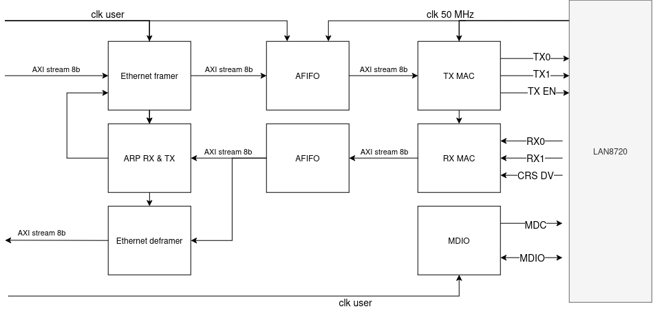
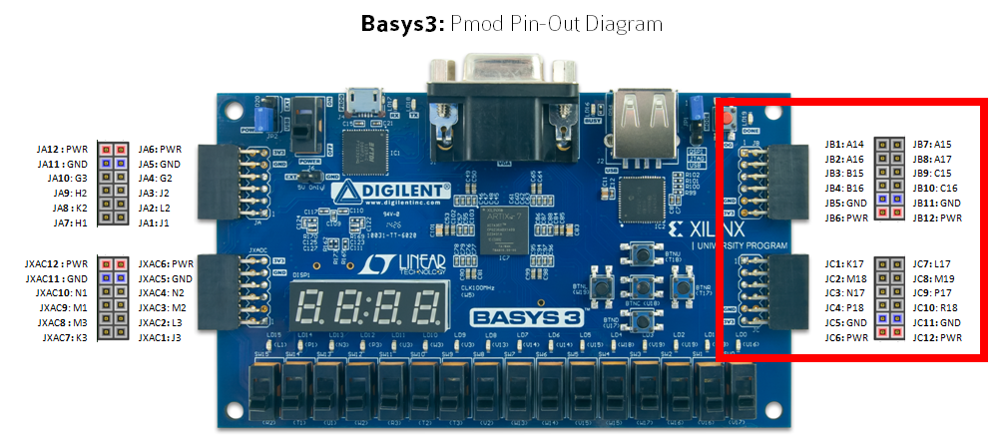

# RMII Ethernet MAC

This repo contains an implementation of an RMII ethernet MAC in VHDL designed for use on an FPGA.

A UDP, IP and ARP stack is also included.

This was originally designed for use with a Digilent Basys3 board and a Waveshare LAN8720 RMII 10/100 Ethernet transceiver.

## Design

The diagram shows the [rmii_mac](src/vhdl/ethernet/rmii/rmii_mac.vhd) entity. This is wrapped by a [rmii_mac_comp](src/vhdl/ethernet/rmii/rmii_mac_comp.vhd) entity that contains a the interface to a register bus for control and configuration.

Only 100 Mbps mode is implemented. A clock enable/divider would have to be added to [rmii_mac_tx](src/vhdl/ethernet/rmii/rmii_mac_tx.vhd) and [rmii_mac_rx](src/vhdl/ethernet/rmii/rmii_mac_rx.vhd) to support 10 Mbps mode.

The rmii_mac uses AXI stream for data transfer. The TX side will backpressure the user code according to the 100 Mbps throughput.
The RX side has no ready signal as there is no way to backpressure the PHY. It is up to the user to supply sufficient buffering.

## Hardware setup

- 1x Digilent Basys3 dev board
- 1x Waveshare LAN8720 RMII transceiver
- 13x Dupont wires
- 1x Micro-USB to USB-A cable for FPGA programming and UART register interface
- 1x Ethernet cable

NOTE: There are many third party clones of the Waveshare LAN8720 and it is hard to tell if you have a genuine part.

### Wiring

The PMOD pins that you connect to the LAN8720 must match what is defined in the [constraints file](example/constraints.xdc).

The example uses the JB and the JC bank on the right hand side (highlighted in the red rectangle in the image below).
Take extra care to ensure you do this correctly.

| Basys3 Schematic Pin | FPGA package pin | LAN8720 pin |
|----------------------|------------------|-------------|
| JB4                  | B16              | TX1         |
| JC1                  | K17              | MDIO        |
| JC2                  | M18              | CLK         |
| JC3                  | N17              | RX0         |
| JC4                  | P18              | TX EN       |
| JC5                  | -                | GND         |
| JC6                  | -                | VCC         |
| JC7                  | L17              | MDC         |
| JC8                  | M19              | CRS DV      |
| JC9                  | P17              | RX1         |
| JC10                 | R18              | TX0         |
| JC11                 | -                | GND         |
| JC12                 | -                | VCC         |

## Building and deploying

The [example](example/) directory contains a test app. The design contains a UDP/IP framer and deframer, and loops back any received UDP packets to the transmit interface.
The [cpp](example/cpp) directory contains a C++ test app to run on a PC connected to the board.
It sends and receives UDP packets to and from the board and checks the data content and throughput.

The app makes use of a UART-APB register interface to configure the ethernet stack.

### Setup

1. Connect the LAN8720 pins to the Basys3's PMOD pins
2. Conenct LAN8270A to your PC with an ethernet cable
3. Connect the Basys3 to your PC via a Micro-USB to USB-A cable

### VHDL

1. Source vivado setup scripts `source /opt/Xilinx/Vivado/2023.2/settings64.sh` (Depends where you have it installed and which version)
2. `vivado` to open the vivado GUI.
3. Create new project > Select Basys3 board (See [Install Digilent's Board Files](https://digilent.com/reference/programmable-logic/guides/install-board-files) for how to install Digilent board files)
4. In the tcl cosole of the Vivado GUI: source the tcl script to read in all source files: `source /path/to/example/source.tcl`
5. Run implementation & generate bitstream
6. Once the FPGA is connected to the RMII LAN8720, open the hardware manager and program the FPGA

### CPP

1. Check and modify parameters (eg IP addresses, ports etc...) in the main function of [main.cpp](example/cpp/main.cpp)
2. `make -C example/cpp`
3. To run loopback test: `./example/cpp/build/apps/basys3_rmii_ethernet`

## Unit tests / testbenches

Some self verifying testbenches exist and use VUNIT. VUINT, GHDL and GtkWave are provided by the `ghdl/ext:latest` docker image. To run the tests from within this container:

1. `./enter-dev-container.sh` (requires docker to be installed and running), pulls the image and opens a shell inside the container.
2. `python3 run_all_tests.py`

## References

- [Basys3 reference manual](https://digilent.com/reference/programmable-logic/basys-3/reference-manual)
- [LAN8720 datasheet](https://www.waveshare.com/w/upload/1/1a/LAN8720.pdf)
- [LAN8720 schematic](https://www.laskakit.cz/user/related_files/lan8720-eth-board-schematic.pdf)
- [Async FIFO design paper](http://www.sunburst-design.com/papers/CummingsSNUG2002SJ_FIFO1.pdf)
- [CDC transfer design paper](http://www.sunburst-design.com/papers/CummingsSNUG2008Boston_CDC.pdf)
- [RMII](http://ebook.pldworld.com/_eBook/-Telecommunications,Networks-/TCPIP/RMII/rmii_rev12.pdf)
- UDP/ARP/IP/Ethernet Wikipedia pages
